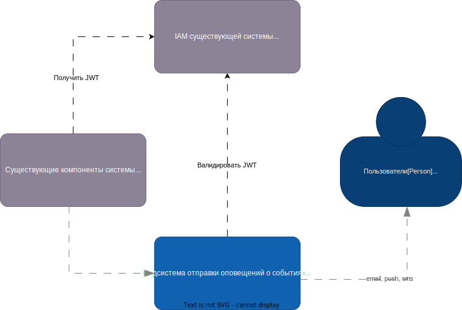
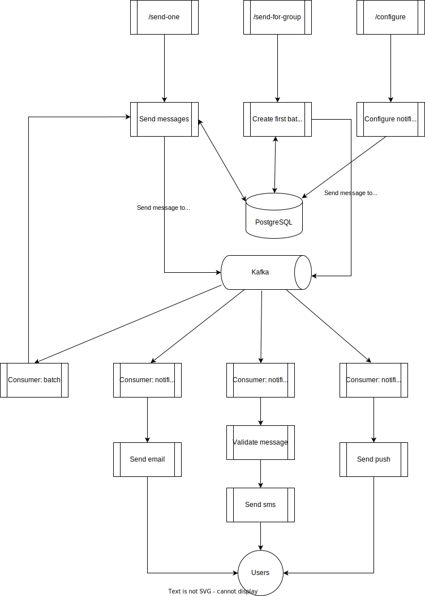

# Технический проект "Сервис отправки оповещений"

## Текущая архитектура

В текущей архитектуре у нас есть мобильное приложение, которое общается с компонентом "Controller", а он в свою очередь делает запросы к "Foo" и "Bar".

## Целевая архитектура

### Диаграмма контекста (C1):

Предполагается, что любой из существующих компонентов может отправить оповещение пользователю. При этом существующие каналы связи и предпочтения по их использованию известны системе оповещений, компоненты остальной системы знать это не должны.

### Диаграмма контейнеров (C2):

### Диаграмма компонентов (C3):

### Визуализация процесса взаимодействия компонентов:

### В ходе разработки технического проекта были приняты и зафиксированы следующие архитектурные решения:
| ID  |   Дата  |   Статус  |   Участники  |   Решения    |
|-----|---------|-----------|---------------|---------------|
| [ADR-001] | [09.10.2023] | [Принято] | [Рябых Павел Александрович]         | [Выбор микросервисной архитектуры для нашей системы уведомлений](static/adr-001.md)     |
| [ADR-002] | [09.10.2023] | [Принято] | [Рябых Павел Александрович]         | [Использование Spring Boot для разработки микросервисов](static/adr-002.md)     |
| [ADR-003] | [09.10.2023] | [Принято] | [Рябых Павел Александрович]         | [Использование PostgreSQL для нашей базы данных](static/adr-003.md)     |
| [ADR-004] | [09.10.2023] | [Принято] | [Рябых Павел Александрович]         | [Использование Apache Kafka для обмена сообщениями и стриминга данных](static/adr-004.md)     |
